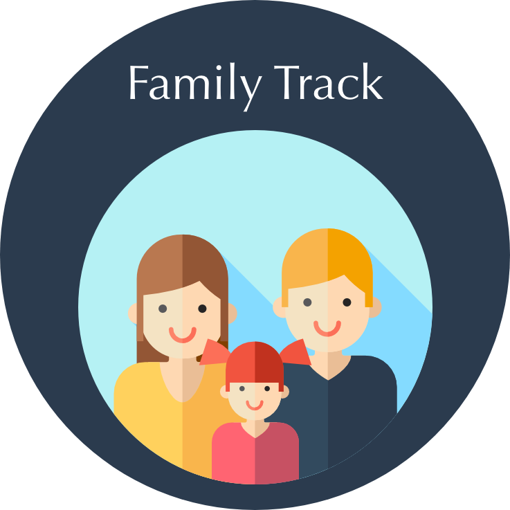
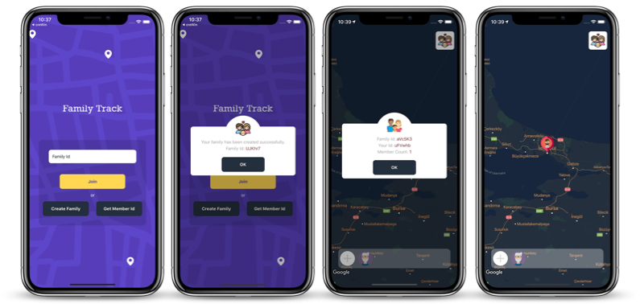

<!-- PROJECT LOGO -->
 

  

  <h3 align="center">Family Tracking</h3>

  

   A Swift project that illustrates family tracking app concept with MVVM.

<!-- ABOUT THE PROJECT -->
## About The Project

Family tracking is an iOS application that I have developed in order to share my experiences and see your feedbacks! I have used latest technologies and paradigms, and also applied MVVM architecture. I need some feedbacks about testability and code  quality. I am open to hear any bad & good feedbacks, they'll be remarkable.

You can also see my programmatic layout style in Swift, with enums. I have inspired from <a href="https://github.com/ozgurersoz/UIStyling">this repository</a>. I highly recommend you to take a look it.

### How does it work?
Family track uses firebase firestore to save family and member informations. I haven't use realtime one, instead map page reloads itself in 30 seconds range. There are two main pages:
1. Main page that users can create membership - family. 
2. Map page that users can see their family member's locations and informations.
    
I have also created a common 'Popupable' controller to show several modals in the app. I am open to any idea for that structure too. I have just created one single view controller and managed with popupType enum. 

### Test data
1. Family Id's
    * 3UxpvD  
    * 3mW13w  
    * 4yFTvT  
    * wxGrbc

2. Member Id's
    * wccAPe  
    * z5jKZX  
    * Dmzd2u  
    * 6PGQmf

### About MVVM

In my MVVM module, I have generally five files to manage a module. 
1. **Contracts**, has some protocols for view model and view and some necessary enums, states etc.
2. **View**, it's ordinary view controller that confirms view model output protocol and responsible to update UI.
3. **Builder**, responsible to create entire modules, including view model, controller and deals with dependency injections too.
4. **ViewModel**, confirms view model protocol and  concerns with all logic stuff such as networking, routing stuff etc. 
5. **Layout**, it's extension of view controller that manages all layout, UI stuff. You can see all auto layout related codes here.

### Techs

* Firebase, Firestore
* Google maps

### Frameworks

* Snapkit
* Lottie

### Topics that you can take a look

* Protocol extensions ✅
* Programmatic layout with snapkit and enums ✅
* Map usage ✅
* MVVM in depth ✅
* Unit test ✅
* Firestore usage ✅

### Future Works

* Map routing
* Applying different patterns including mvvm-c and viper, I can add extra pages for viper.
* SwiftUI version
* Blog post about MVVM in my personal [blog.](https://eyupgoymen.github.io/)

## Contributing

Any contributions you make are **greatly appreciated**. I am excited to hear you feedbacks to improve my code style. You can reach me via LinkedIn profile given in below.

## License

Distributed under the MIT License. See `LICENSE` for more information.

## Contact

1. LinkedIn: [eyupgoymen](https://www.linkedin.com/in/eypgym/)
2. Github: [eyupgoymen](https://github.com/eyupgoymen)
